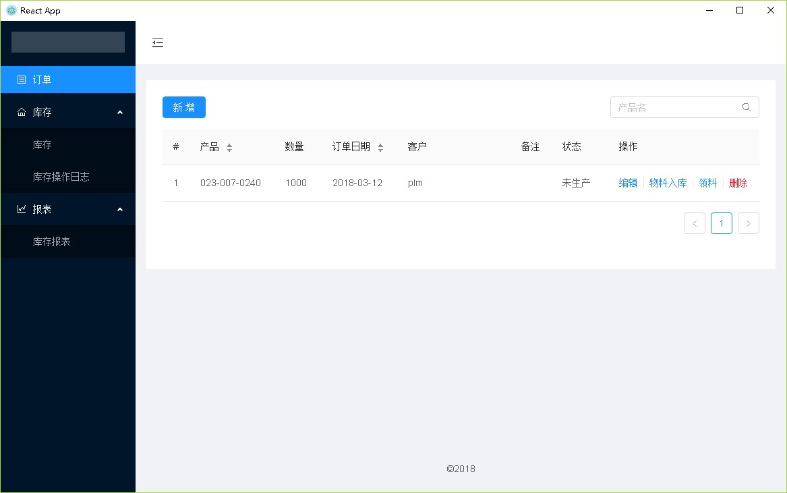
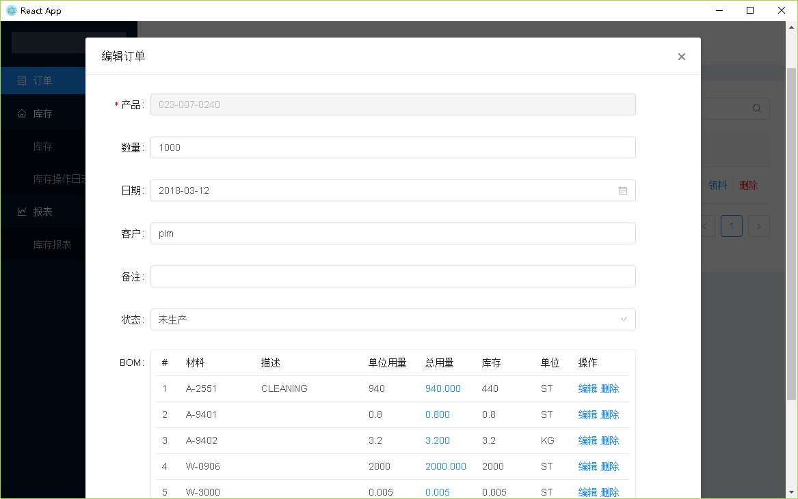

# order-bom-manager
A simple order/stock manager for manufacturing. Based on electron react nedb ant-design.

## Install
```bash
npm install
```

## Getting Started
```bash
npm start
node_modules/.bin/electron .
```

## Packaging
Manually modify the "DEV" property in package.json to "false".
```bash
npm run build
npm run electron-build
```

## Screenshots



